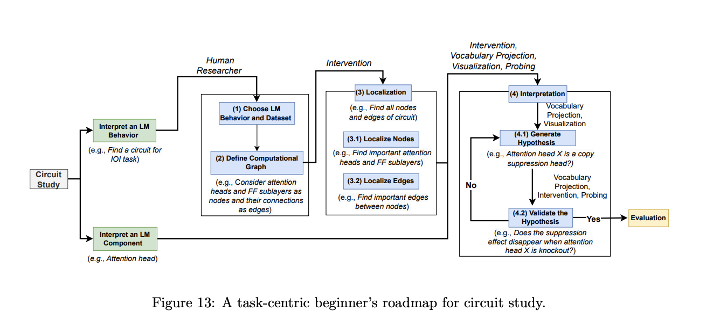

An informal glossary on various mechanistic interpretability terms, techniques, and metrics. This is inspired by Neel Nanda's glossary (linked [here](https://www.neelnanda.io/mechanistic-interpretability/glossary)) and [A Practical Review of Mechanistic Interpretability for Transformer-Based Language Models](https://arxiv.org/pdf/2407.02646) but I thought it might be useful to create my own version to consolidate my learning.

::: {.callout-note}
This is a live blog (meaning it is bound to change rapidly), and you can see when the last edit was made. A clear note will be posted when this document is no longer actively maintained.
:::

Please note that the terms in this glossary are not in any coherent order; they're just listed randomly. The best way to search this is to use the table of contents or just press Command-F to find what you're looking for. Also, this post assumes basic familiarity with attention mechanisms and the transformer architecture - check out the following pages if you'd like a refresher:
1. [ The Illustrated Transformer (Jay Alammar)](https://jalammar.github.io/illustrated-transformer/)
2. [A Walkthrough of Attention ](https://adityaiyer7.github.io/blogs/posts/attention-mechanism/#general-formulation-of-multi-head-attention-mha)

**Last Updated: 8th June, 2026**

# Search Table

| Type        | Term                         | Status |
| ----------- | ---------------------------- | ------ |
| Terminology | Mechanistic Interpretability | Ready  |
| Terminology | Circuits                     | Ready  |
| Terminology | Features                     | Ready  |
| Terminology | Attention Logit <br>         | WIP    |
| Terminology | Logit                        | WIP    |
| Terminology | Residual Stream              | Ready  |
| Methods     | Standard Activation Patching | WIP    |
| Methods     | Path Patching                | WIP    |
|             |                              |        |


# Terminology

## Mechanistic Interpretability

Mechanistic interpretability is the field of study that aims to reverse-engineer the internal workings of neural networks by analyzing the mechanisms underlying their computations. [Source](https://en.wikipedia.org/wiki/Mechanistic_interpretability). For more information, see the methods section. (TODO, link)

## Circuits

### Computation Graphs
Neural networks can be thought of as computational graphs. For example, consider the logistic regression algorithm (logistic regression is equivalent to a one-layer neural network with no hidden layers). Mathematically, it can be represented as $y= \sigma(wx+b)$ where $\sigma$ is the sigmoid activation function.  This can be represented as a computation graph as follows:

```{mermaid}
flowchart LR
    w["w"] --> mult(("mul"))
    x["x"] --> mult

    mult --> add(("add"))
    b["b"] --> add

    add --> sigma(("sigmoid"))
    sigma --> y["y"]
```
Similarly, if we wanted to express single-head masked attention as a computational graph, we might have something like this:
```{mermaid}
%%{init: {"flowchart": {"nodeSpacing": 20, "rankSpacing": 25}, "themeVariables": {"fontSize": "13px"}} }%%
flowchart TB
    X["X"]

    X --> qProj(("×"))
    Wq["Wq"] --> qProj
    qProj --> Q["Q"]

    X --> kProj(("×"))
    Wk["Wk"] --> kProj
    kProj --> K["K"]

    X --> vProj(("×"))
    Wv["Wv"] --> vProj
    vProj --> V["V"]

    Q --> qkMul(("×"))
    K --> qkMul
    qkMul --> S["QKᵀ"]

    S --> div(("÷"))
    dk["√dₖ"] --> div

    div --> addMask(("＋"))
    M["M"] --> addMask

    addMask --> sm["softmax"]
    sm --> P["P"]

    P --> outMul(("×"))
    V --> outMul
    outMul --> A["A"]
```

As you can see, this is already getting pretty complicated to draw by hand, so I won't bother with multi-head attention or MLP layers. Hopefully, the point about computational graphs is clear.

**Circuits**: In the context of Mechanistic Interpretability, circuits usually focus on the smallest causal subgraph that explains a particular behavior (I'm using the word smallest loosely here). However, it's important to note that when we're talking about circuits, we typically do not go into the same level of granularity as we did above (i.e., our nodes are usually not as granular as weights). Typically, when we're talking about circuits, our nodes could be model components (i.e an attention head could be a node). For example, a one-layer transformer represented at the granularity of model components could be represented as:
```{mermaid}
%%{init: {"flowchart": {"nodeSpacing": 12, "rankSpacing": 18}, "themeVariables": {"fontSize": "12px"}} }%%
flowchart TB
    T["tokens"] --> E["embed"]
    E --> R0["resid 0"]

    R0 --> LN1["LN"]
    LN1 --> H0["L0H0"]
    LN1 --> H1["L0H1"]
    LN1 --> H2["L0H2"]
    LN1 --> H3["L0H3"]

    H0 --> AO["attn out"]
    H1 --> AO
    H2 --> AO
    H3 --> AO

    R0 --> ADD1["resid add"]
    AO --> ADD1
    ADD1 --> R1["resid 1"]

    R1 --> LN2["LN"]
    LN2 --> MLP["MLP"]

    R1 --> ADD2["resid add"]
    MLP --> ADD2
    ADD2 --> R2["resid 2"]

    R2 --> LN3["final LN"]
    LN3 --> U["unembed"]
    U --> Y["logits"]
```
Note that the diagram above is not a circuit; it's a model representation. Hypothetically, let's say the model predicts the next token by using one attention head to route relevant context, then an MLP transforms/amplifies that information, and the unembedding reads it out. In that case, our circuit looks something like this (note we're omitting Layer Norm as an abstraction choice):
```{mermaid}
%%{init: {"flowchart": {"nodeSpacing": 10, "rankSpacing": 16}, "themeVariables": {"fontSize": "12px"}} }%%
flowchart TB
    T["tokens"] --> E["embed"]
    E --> R0["resid 0"]

    R0 --> H2["L0H2<br/>relevant head"]
    H2 --> R1["resid 1"]

    R1 --> M["MLP<br/>feature transform"]
    M --> R2["resid 2"]

    R2 --> U["unembed"]
    U --> Y["target logit"]

    H2 -. "routes info" .-> M
    M -. "boosts feature" .-> U
```

Once the circuit is identified, we analyze each node (component) to determine its role in the circuit's behavior. Some tools for analyzing components include Linear Probes and Sparse Auto Encoders (among others).

Here's a more concise image, talking about circuit discovery and interpretability:


[Source: A Practical Review of Mechanistic Interpretability for Transformer-Based Language Models](https://arxiv.org/pdf/2407.02646)


## Features

In traditional machine learning (statistical learning techniques), features are handcrafted. Think back to the canonical example of predicting house prices with linear regression. In most of these models, we handcraft certain features that the model uses to make its prediction. In that sense, features can be described as inputs that the model uses to make its prediction. However, in the context of deep learning, that definition breaks down because we don't provide handcrafted features to models. Instead, we just throw data at the models and let them figure out what features are, which is why features in the context of deep learning are extremely tricky to define. Therefore, we end up doing this whole song and dance of trying to interpret these models. While I'm not terribly happy with this definition, a working definition people seem to use is as follows: a feature is a human-interpretable property encoded in activations.

[Source: A Practical Review of Mechanistic Interpretability for Transformer-Based Language Models](https://arxiv.org/pdf/2407.02646)


## Attention Logit

This term refers to the pre-softmax attention scores.
$$
\text{attention logit} = QK^{T}/\sqrt{d_k}
$$


## Logit

In statistics, a logit is typically defined as the log odds ratio, so mathematically it is $\text{log}(p/1-p)$
In deep learning, the logit has a slightly different meaning. A logit is technically the unnormalized, raw scores before it gets normalized. For example, the attention scores before it goes through the softmax are the attention logit (see above). Note, it does not have to always go through a normalizing function. For example, in the literature, MLP scores are also called logits, but they do not go through a normalizing function (since they're typically paired with RELU/GELU).

I like to think about it simply as the pre-activation function scores.

## Superposition

## Residual Stream
The residual stream is a component of the transformer architecture - it doesn't have a precise definition per se, but it's most often thought of as a communication channel, allowing different parts of the model to read and write into different subspaces of the residual stream. One helpful analogy I got from notebookLM is to think of the residual stream as a whiteboard passed down a line of students, where each student reads and writes on it. The residual stream is extremely important from an interpretability perspective. One of the primary reasons is that the attention heads and MLP neurons enforce additivity in the residual stream, allowing us to isolate the effect of each component via Path Patching.
For a more detailed explanation of the residual stream's additivity, see my post [here](https://adityaiyer7.github.io/blogs/posts/additivity-of-residual-stream/).
For more on Path Patching, search this document (command/control + F).


## Linear Representation Hypothesis


# Methods

## Linear Probing

## Sparse Autoencoder (SAE)

## Natural Language Autoencoder (NLA)

## Activation Patching

### Standard Activation Patching
In standard activation patching, we patch the output activations of a given component in the circuit. Once this component’s output is replaced, we let the model run normally from that point onward. As a result, any downstream component that reads from or depends on those activations can be affected.

This tells us whether the component matters for the behavior, but it does not by itself tell us which downstream path or connection is responsible for that effect.

### Path Patching
This is a patching technique that helps us distinguish between two questions:

1. Does this component matter?
2. Does this component matter directly, or does it only contribute indirectly through downstream components?

In general, if you think of a circuit as a computational graph, you could go in and patch across any edge, or even multiple edges, thereby defining a path through the graph. By patching, I mean replacing the activation values at a given component or layer with the corresponding values from a clean run, using those from a corrupted run.

Of course, patching directly through the residual stream is also feasible since it is linear. For example, if you wanted to test whether the MLP at Layer 10 of a transformer directly contributes to the output, you could intervene on the residual stream before the final logits are computed and patch in the contribution of MLP 10. Similarly, you could do this along other edges. For instance, if you wanted to study how MLP 10 affects MLP 11, you could patch the contribution of MLP 10 at the point where MLP 11 reads from the residual stream.

Note that this differs from pure activation patching, in which we patch the output activations of a given component and then allow all its downstream effects to propagate normally.

A paper that I found useful to intuitively understand this concept is linked [here](https://arxiv.org/pdf/2305.00586).


### Subspace Activation Patching

### Attribution Patching

### Edge Attribution Patching


## Subspace Geometry (Physics Interp paper)

## Patch Level Decoding (Physics Interp paper)

## Integrated Gradients


# Metrics

# Cool Papers

