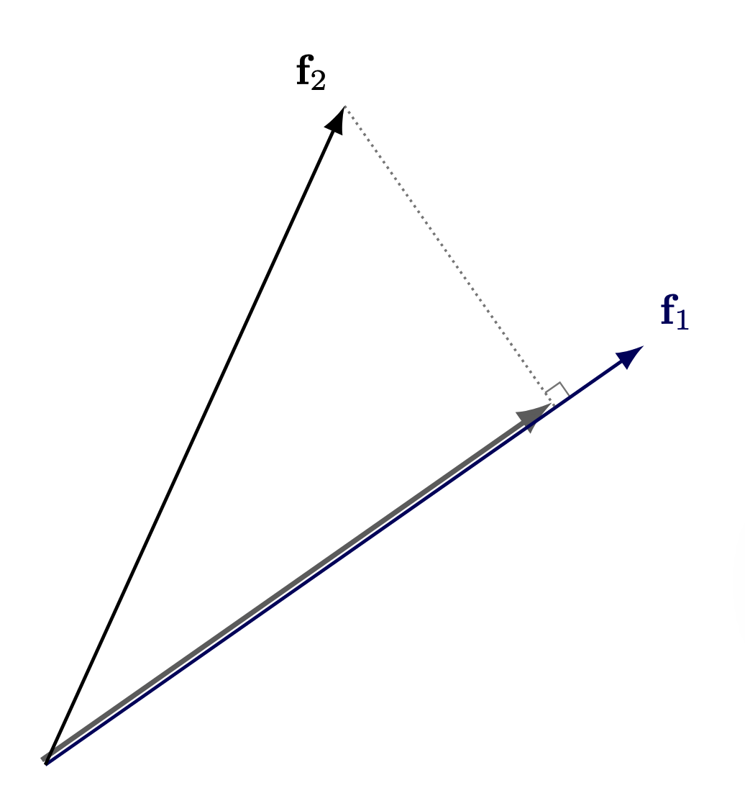
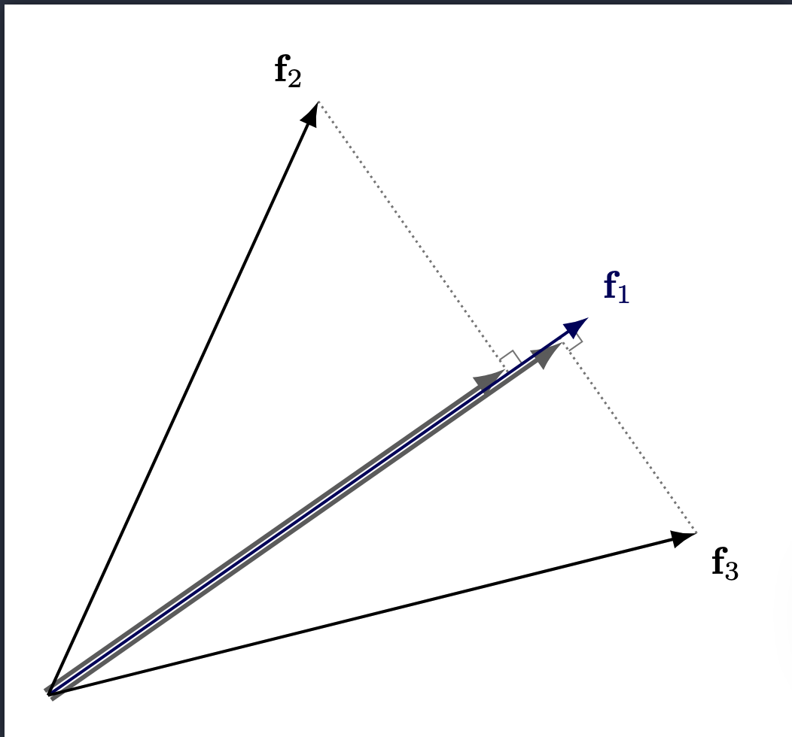
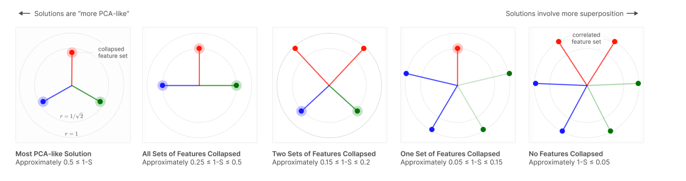
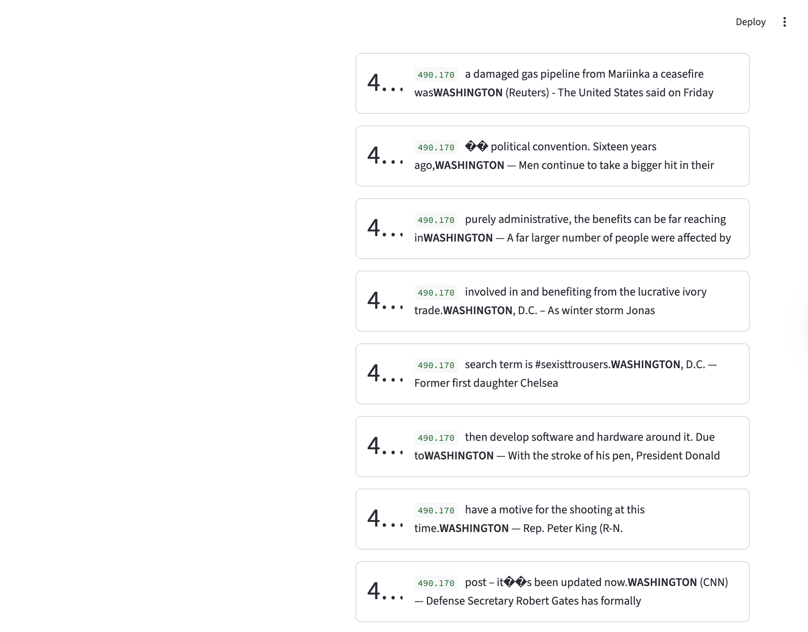
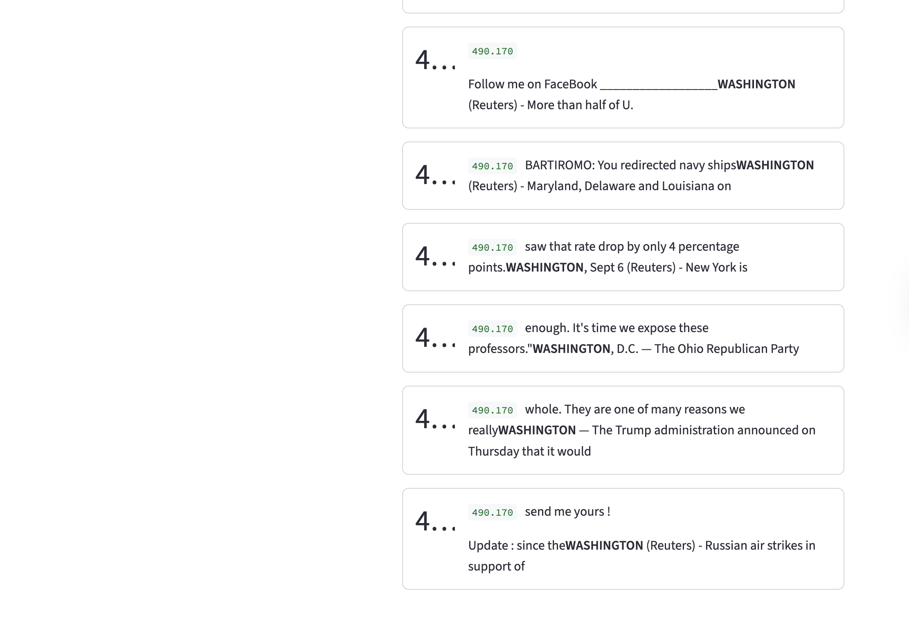
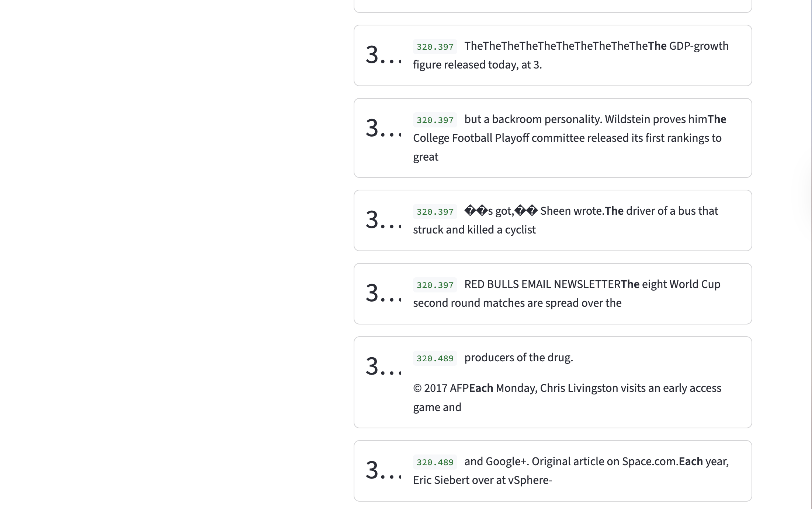
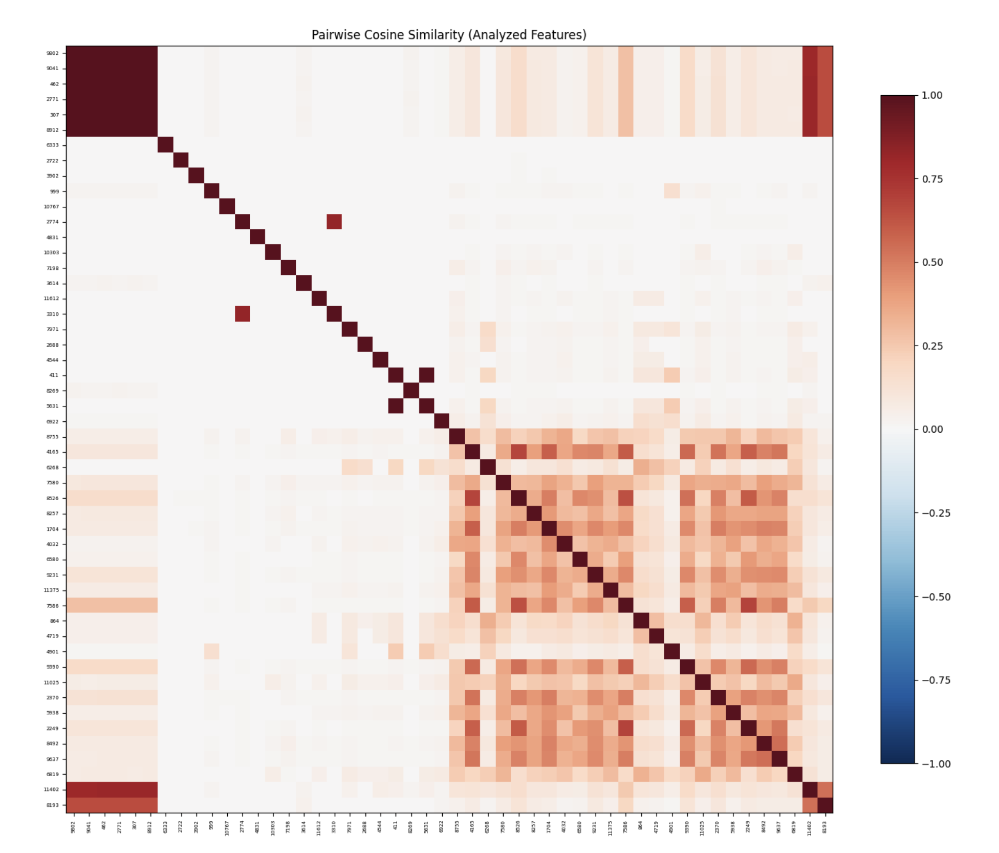

# Background
Before diving into the experiment and results, I want to take some time to build the story and explain why we're doing this. Specifically, I want to touch on what the main question is, and some useful concepts that'll help us along the way.

## How do models represent information?

###  Linear Models

Before we answer this question for more complicated models like Neural Networks, let's take a look at (relatively) simpler models like Linear Models. In linear models (e.g., linear regression), each feature is assigned its own dimension. Borrowing from a canonical linear regression example, if you're trying to predict house prices using 5 features, say number of bedrooms, walking score, year of construction, neighborhood, and square feet, then each of your data points gets embedded in a 5-dimensional space where a feature is represented by a basis direction (the basis is orthogonal). Our initial representation looks something like this

$$y = w_1x_1 + w_2x_2 + w_3x_3 + w_4x_4 + w_5x_5$$

In this representation, each $w_i$ tells us how much importance to give to each feature $x_i$.

However, in this simplistic model, we fail to account for bias, so our line must pass through the origin (this is restrictive, as you might imagine). To fix this, we add a bias term (all 1's) so our hyperplane can move freely, leading to the result

$$y = w_1x_1 + w_2x_2 + w_3x_3 + w_4x_4 + w_5x_5 + w_6 \cdot 1$$

Note that this now becomes a representation in 6 dimensions (the 6th dimension is just all 1's), or more canonically, we write

$$\sum_{i=1}^{5} w_i x_i + b$$
where $w_6 = b$.

This is a long winded way of saying that in linear models, we have the luxury of giving each feature its own dimension. This is possible to do because linear models get hand crafted features as input, but how do you hand craft features for things like images, audio, text etc? This is an incredibly difficult thing to do in practice! This is where more modern methods like Neural Networks come in. We're able to pass in raw real world data (with some pre-processing of course) and have them work incredibly well! This is what makes them so versatile, but also so much harder (and interesting!) to study. This begs the question how the hell are they actually storing information?

### Neural Network Basics

Before we go into the specifics of Neural Network Interpretability, it's worth reviewing some of the basic terminology associated with neural networks (this will save us pain in the future).

1. **Neuron**: A neuron is a computational unit, that takes in a weighted sum of inputs, and passes it through a non linearity. Non linearities are what make neural networks so powerful and versatile. Without this, they'd be just a composition of linear transformations. These non linear functions are also called activation functions, and the output of a layer of a neural network is called an activation vector.
2. **Weights**: This is analogous to our linear regression example, it tells us how much to weight each input (or each component of a vector)
3. **Bias**: Similar to the linear regression case, this helps serve as an offset. There is also some study done on how bias affects feature alignment, but this is still in early stages, and as far as I'm aware is only applicable for toy models. Regardless, its an interesting read (toy models paper linked below)
4. **Features**: I think the notion of a feature is somewhat ambiguous when it comes to neural networks, which is one of the significant pain points of neural network interpretability. But, for the purposes of this blog, we follow the same convention used by Anthropic Papers (linked below), and say a feature is a direction in activation space (activation space, is just the vector space where the activation vector lives). This definition is non trivial and implicitly assumes that the linear [representation hypothesis](https://arxiv.org/abs/2311.03658) is true.

If you would like a primer to neural networks, [here's](https://www.youtube.com/watch?v=aircAruvnKk&list=PLZHQObOWTQDNU6R1_67000Dx_ZCJB-3pi) a great playlist.  

The following sections heavily borrow from these two papers:

1. [Toy Models of Superposition](https://transformer-circuits.pub/2022/toy_model/index.html)
2. [Towards Monosemanticity : Decomposing Language Models with Dictionary Learning.](https://transformer-circuits.pub/2023/monosemantic-features)

I have picked some important terminology for the purposes of this blog. However, there are several nuances that I don't cover in detail (if at all) to avoid repeating information, but I highly recommend reading them.

## Superposition

In linear models, we were able to allocate a dimension to each feature, but this is limiting in some sense - if we want to represent more features, we need to add more dimensions. The main bottleneck here is orthogonality between features. In a d-dimensional orthogonal space, you can have at most d orthogonal vectors. However, if we relax this orthogonality constraint, in a d-dimensional space, we can fit exponentially many nearly orthogonal vectors. This is how neural networks are able to represent more features than dimensions.

However, because we no longer have complete orthogonality, these vectors now interfere with each other 

{width=50%}

Note: This diagram represents interference from the perspective of only one feature, but interference is symmetric. If Feature $f_2$ projects onto $f_1$'s direction, then $f_1$ also projects onto $f_2$'s direction by the same dot product. The more features that are activated, the worse the interference is across all of them. 

The model's ability to represent more features than dimensions is called superposition.

For superposition to be useful, there's a key assumption we make (which seems well supported): sparsity.

## Sparsity

Sparsity is exactly what it sounds like - out of all the possible set of features (potentially very large), only a few of them activate for a given input. Think about it, if you have an image of a penguin eating fish, there's no reason you'd want the neural network to activate features related to an airplane (ofc there's nuance in this example, but the point still stands - most natural inputs don't activate close to as many features as the model can represent). This is cool and all, but why do we actually need sparsity to be true for superposition to be useful?

To answer this, let's consider what happens when we're working in a dense regime (we assume many features activate at the same time). Now, if we're in a dense regime, the interference is naturally higher, since there are more active vectors and therefore more projections. As a result, faithful reconstruction becomes harder because we're corrupting the signal with some non-trivial (and potentially strong) amount of noise.

{width=50%}

(It's fairly straightforward to see how more features will add more projections (noise))

However, in a sparse regime, only a few features activate for any given input, so the effect of interference is minimal, helping us pick up the signal from the noise.

You might be wondering, is this constraint limiting? This constraint isn't arbitrary; it reflects the structure of real-world data. We design the loss function to enforce sparsity precisely because natural inputs are themselves sparse, as we saw in the penguin example (more on the loss function later). The model isn't being forced into an artificial regime.


The way features align across these different regimes is very interesting. As we move into a dense regime, the features become similar to PCA.


*Source: [Toy Models of Superposition](https://transformer-circuits.pub/2022/toy_model/index.html)*


## Polysemanticity
A neuron is said to be polysemantic if it activates for multiple unrelated inputs. In other words, if the activation value of a neuron is non-trivial for unrelated inputs, say penguins and venture capitalists, then the neuron is said to be polysemantic.

If you're wondering what the difference between polysemanticity and superposition is, polysemanticity is a defined as a property of a neuron, whereas superposition is the ability of the model to represent more features than dimensions. Features are arbitrary directions in activation space, and neurons are basis aligned (what this means is the output of a particular neuron is along a basis in $\mathbb{R}^d$ If we have d neurons.

## Monosemanticity
Monosemanticity is the opposite of polysemanticity; or more simply put, if a neuron consistently activates for related inputs (say, for example, penguins, birds, ice - all concepts related to Antarctica) then they're said to be monosemantic.


## Privileged vs Non-Privileged Basis

**Privileged basis** means that there is an incentive for feature directions to align with the basis direction. What does this mean?

Say we have a neural network, with $d$ hidden neurons. As a consequence, the activation space for the hidden layer is $\mathbb{R}^d$, and the canonical basis is represented by $(e_1, e_2, \ldots, e_d)$.

When we say a feature $f_i$ aligns with a basis direction, we mean all entries other than the index $i$ are zero. In other words, $f_i = (0, \ldots, 1, 0,\ldots,0)$ (1 at index i). So our activation vector, in this case, is represented by $a = k_if_i$, so the activation vector is just scaling a basis direction. This is a special case, when only a feature $i$ ($f_i)$ is present, but we can extend this idea more generally when multiple features are present at the same time:
$$
a = \sum_{i=1}^{d}k_if_i = (k_1, k_2, \ldots, k_d)
$$
This is actually a very neat representation, since we're able to represent multiple features (or have multiple features be active at the same time) without the cost of interference since our basis is orthogonal.

If you're wondering how $k_i$ is determined, recall that $Wx+b \in \mathbb{R}^d$. We then pass this vector into ReLU, and each index of this post-ReLU vector gives the value for $k_i$.

Note, that just because there is incentive for a model to align features with the basis directions, doesn't necessarily mean it happens. There could be other (potentially stronger) forces that override how features get represented. In fact, many times, when the model wants to represent more features than dimensions (aka be in superposition), it aligns away from the privileged basis.

Some examples of a privileged basis are activation spaces of convolutional neural networks, multi layer perceptrons (MLP) etc.

The mechanics of how (and why) privileged basis form are out of the scope of this blog (it relates to how ReLU folds the activation space).


**Non Privileged Basis** means that there is no reason to believe that basis dimensions are special, and that features can be thought of as arbitrary dimensions in space.

Examples of non privileged basis include word embedding models, transformer residual stream, etc.

## Features
This is a repeat of the point mentioned earlier, but I think it's worth emphasizing again. I should note that the field is still debating what a feature is, and, as of now, from my understanding, it doesn't have a very neat, concrete definition.

# Sparse Auto Encoders (SAE) as a tool for Monosemanticity

Now that we've covered a bunch of terminology, we're ready to go into the main tool, that helps us understand these models better (at least to some degree). Recall that the residual stream of a transformer is in a non privileged basis, and is polysemantic in nature. This makes it difficult to peek into the models activations and understand whats going on. Is there a way we can take this representation and convert it into a somewhat monosemantic representation with a privileged basis?

That's what Sparse Auto Encoders aim to do. They aim to represent this activation vector in an overcomplete basis (overcomplete relative to the activation vector dimension size). This way the model has more freedom to choose a better representation.

Also, a related hypothesis states that the model lacks enough dimensions to represent all the features that it wants to, and is in some sense noisily simulating a larger model (I should note, that to the best of my knowledge, this remains a hypothesis). A Sparse Auto Encoder has two parts, namely an encoder and a decoder. The encoder takes our activation vector ($x$) and represents it in a higher dimension. The decoder takes this encoded representation, and maps it back to the activation space.

Some terminology that will help us out here:
- Residual Stream : Running sum that persists across layers. We extract the residual stream at layer 6 ($x$)
- Activation Space: This is where the residual stream lives
- Encoded Vector: This is what we get after we pass through the residual stream through the SAE's encoder layer ($h$)
- Hidden Space: This is the space where the encoded vector lives
- Decoded Vector: This is what we get, in the activation space, after we pass in the encoded vector through the decoder layer of the SAE ($\hat{x}$).

$$
h = ReLU(W_{enc}(x-b_{dec}) + b_{enc})
$$
$$
\hat{x} = W_{dec}h + b_{dec}
$$
The overcomplete basis, helps us get a more monosemantic representation and the ReLU activation function, encourages a privileged basis which makes it more interpretable, since we can now look at each neuron and ask "what does this do?"

## Loss
### Loss Breakdown
The loss function we use in this experiment is
$$
loss = MSE(x,\hat{x}) + \lambda L_1(h, \mathbf{0})
$$

The first term of the loss function gives us a sense of our reconstruction fidelity, and the second term enforces sparsity. The first term is fairly straightforward, so I won't go into too much detail here, but the second term is worth examining more closely (too see why we care about reconstruction fidelity see the section below)

Basically, in the second term, we're computing the L1 loss between our encoded representation and the 0 vector of the same dimensions. This tells us what dimensions get activated (and it gives us the sum). The sparsity parameter (lambda) tells us how much to penalize this term, so a smaller lambda allows more dimensions to get activated.

### Why this specific loss function?

There could be other loss functions that we design, but this one is fairly intuitive given that we need a loss function that can balance both reconstruction fidelity and sparsity.

Now you might be wondering, why do we bother with the reconstruction quality at all in the first place? Well, we need a way to verify that the encoded representation is faithful to the actual activation vector, and that the model isn't creating arbitrary representations. 

Since the reconstruction fidelity is directly impacted by the encoded representation (since $\hat{x} = W_{dec}h + b_{dec}$), measuring the reconstruction fidelity is a good way to know that the model stays truthful to its original representation.

##  Design Choices and Justifications

1. **We subtract the decoder bias from the input**: The justification for this can be understood if we see what the decoder is doing. The decoder is taking the hidden representation and aims to convert it back to $x$, or at least as close as it can get to it. In doing so, it adds $b_{dec}$ to $W_{dec}h$. Since $h$ is an encoded representation of $x$, if $x$ contained $b_{dec}$ then we introduce a redundancy in the reconstruction. Now, if you're wondering if we lose anything by subtracting $b_{dec}$ from $x$, the answer is no, because we're just offsetting each input. The relative distance between inputs is preserved. Also, more importantly, $b_{dec}$ learns the mean activation of the data, so by subtracting it we allowing the encoder to focus only the parts that vary with each input, thereby freeing up hidden dimensions that would have otherwise been wasted on the mean.  
2. **We normalize the decoder weights**. The model is simultaneously trying to minimize both the terms in the loss function. If we left the decoder weights unconstrained, the model would try to make $h$ as small as possible (since it can achieve the same reconstruction fidelity). However, this would be a somewhat of a confounder, and make sparsity less insightful - since we wouldn't be able to tell for sure if the model is creating an accurate sparse representation or if $h$ is made artificially small to reduce the second term, while achieving the same performance on reconstruction. Now, with $\|d_i\|=1$ fixed, $d_i$ and $h_i$ can no longer trade off against each other. 

## Dead Neurons
### What are dead neurons?

We use a Sparse Auto Encoder to give the model the ability to represent data with more space - I like to think about this as the model stretching its legs. Something that may have been a compressed representation (i.e., not a clean, human-readable feature) in a lower dimension can become more mono-semantic, with one dimension representing a human-interpretable feature.  During training, an interesting observation is that many dimensions are dead (i.e., they don't activate for any input). Based on my training runs, here's a table that highlights the proportion of dead neurons for a given expansion and sparsity factor (lambda).

| Lambda/Expansion Factor | 4x    | 8x    | 16x   | 32x   |
| ----------------------- | ----- | ----- | ----- | ----- |
| 1e-2                    | 13.1% | 26.3% | 29.3% | 35.2% |
| 1e-4                    | 15.4% | 27.5% | 33.4% | 35.6% |

(Note, expansion factor is how much we expand GPT-2's residual stream dimension (768) by)

Note: In the experiment that I ran, a feature is considered to be dead if all activation values for that feature are below 0.07. This was chosen arbitrarily, different thresholds would potentially lead to different results, but since this number is a small threshold, it should capture the general trend pretty well.

This is interesting. Even though the model has more space to represent data, it only uses a fraction of it? A natural next question is - Why does this happen?

### Why do dead neurons occur?

My initial thought here was to see what would happen if we simply relaxed lambda a little bit. I thought 1e-2 might be enforcing sparsity too strongly. So I changed it to 1e-4, but, it didn't lead to much improvement in the proportion of dead neurons. To understand what's happening here, we need to revisit the encoding equation.
$$
h = ReLU(W_{enc}(x-b_{dec}) + b_{enc})
$$
where $h$ is our encoded vector  and $x$ is the residual stream activation vector.

During training, we feed in both the features ($h$) and results ($\hat{x}$) into the loss function. See loss section for more details, but as a recap, our loss function is:
$$
loss = MSE(x,\hat{x}) + \lambda L_1(h, \mathbf{0})
$$
Or for ease of representation, we drop the vector format for now, and zoom in on individual elements
$$loss = \frac{1}{d}\sum_{i=1}^{d}(x_i - \hat{x}_i)^2 + \lambda\sum_{j=1}^{m} ReLU\left(\sum_{k=1}^{d} W_{enc_{jk}}(x_k - b_{dec_k}) + b_{enc_j} - 0\right)$$

Notice that the first term of the loss, doesn't actually care about the sparsity, and since we're concerned with dead neurons in the SAE hidden layer (encoded layer), we're only interested in the second term of the loss function. (I should note that "doesn't care about sparsity" is an oversimplification, it does indirectly care, and it pushes against dead neurons, since if a neuron dies, the reconstruction quality could suffer, a more accurate statement is that the MSE term doesn't actively penalize the sparsity directly)

Now, something interesting happens when we take the derivative of the loss function with respect to encoder weights. Because there's a ReLU function, if the term inside the ReLU is negative, then ReLU clamps it to 0, and the derivative also ends up being zero, so no signal propagates further and that dimension is marked as dead. For example sake, lets see what happens when we consider an arbitrary dimension 2345

$$
z_{2345} = \left(\sum_{k=1}^{d} W_{enc_{2345,k}}(x_k - b_{dec}) + b_{enc_{2345}} - 0\right)
$$
and
$$
f_{2345} = ReLU(z_{2345})
$$
If $z < 0$ then $f_{2345} = 0$ and the gradient $\frac{\partial f_{2345}}{\partial z_{2345}} = 0$

So when we take the gradient of the loss term, the backward pass gives us
$$
\frac{\partial L}{\partial W_{enc_{2345,k}}} = \frac{\partial L}{\partial f_{2345}} \cdot \frac{\partial f_{2345}}{\partial z_{2345}} \cdot \frac{\partial z_{2345}}{\partial W_{enc_{2345,k}}}
$$

Since the middle term $\frac{\partial f_{2345}}{\partial z_{2345}} = 0$, the entire gradient gets set to zero. Now, if there is no gradient signal in that direction for all inputs, then that dimension is always zero for all encoded vectors $h$.

Also note that in the reconstruction, we multiply $W_{dec}$ with $h$, so if a dimension is always 0 in the encoded space, it contributes nothing to the reconstruction either, so you might be wondering if the MSE term has incentive to revive a dead neuron to improve reconstruction fidelity. Yes, but the model is unable to do that because it still passes through the same ReLU gate. Or to be more precise,
$$
\frac{\partial L_{MSE}}{\partial W_{enc_{j,k}}} =
\frac{\partial L_{MSE}}{\partial \hat{x}} \cdot
\frac{\partial \hat{x}}{\partial f_j} \cdot
\frac{\partial f_j}{\partial z_j} \cdot
\frac{\partial z_j}{\partial W_{enc_{j,k}}}
$$
Like before, the $\frac{\partial f_j}{\partial z_j} =0$ so the MSE term can't revive the neuron either.

**Summary**

1. **Sparsity term:** $\lambda \cdot f_{2345} = \lambda \cdot 0 = 0$ — contributes nothing
2. **Reconstruction:** $\hat{x}_i = \sum_j W_{dec_{ij}} f_j + b_{dec_i}$ — the $j=2345$ column of $W_{dec}$ gets multiplied by 0, so **this feature contributes nothing to the reconstruction either**.
3. MSE is not able to revive dead neurons.

### Fix to the dead neuron problem
At some given checkpoint, we do the following:

(Note that when we're talking about neurons here, we're referring to the neurons of the SAE, so when we refer to inputs, we're referring to the activation vector of GPT-2 residual stream)

1. At some checkpoint, figure out which neuron directions have not fired at all.
2. Take a random sample of data points and compute the loss.
3. Assign each data point a sampling probability that is proportional to its contribution to the loss (this is because if there are certain points the model is struggling to represent, we should try and promote those).
4. Take the normalized input (activation vector), drawn from this sampling distribution and set the dead neurons to this vector.
5. We do the same thing for the decoder neurons as well.
```
W_enc[:, dead_neuron] = normalized_vector
W_dec[dead_neuron, :] = normalized_vector
```
(Note: `W_enc` is stored as `[input_dim, hidden_dim]`, so hidden neurons correspond to columns. This is the transpose of the convention implied by the formula notation $W_{enc}(x - b_{dec})$, but the computation is equivalent.)
6. We then reset the bias, to a small negative value.
7. Reset Adam optimizer state.

**Sampling Design Decisions**

1. **Why do we normalize activation vector?** Essentially the same reason mentioned earlier. If we didn't normalize, it would bias the neuron to fire strongly across the board, not just for this particular input. 
2. **Why do we reset the bias?** Making this a mild negative value, just acts like a mild prior toward sparsity. We notice some neurons don't fire, but we don't want our interference to be drastic or severe and we want the models to learn. We want the neurons to be alive only if the features align with it, and the negative bias acts as a gate in some sense, to make sure the feature is aligned with the neuron. 


**Dead Neuron Proportions With Sampling**

| Lambda/Expansion Factor | 4x    | 8x    | 16x    | 32x    |
| ----------------------- | ----- | ----- | ------ | ------ |
| 1e-2                    | 4.8%  | 3.9%  | 15.7%  | 26.97% |
| 1e-4                    | 5.24% | 4.51% | 11.72% | 23.43% |


**Dead Neuron Delta (No Sampling - Sampling)** 

| Lambda/Expansion Factor | 4x     | 8x     | 16x    | 32x    |
| ----------------------- | ------ | ------ | ------ | ------ |
| 1e-2                    | 8.3%   | 22.4%  | 13.6%  | 8.23%  |
| 1e-4                    | 10.16% | 22.99% | 21.68% | 12.17% |

# Results
## Training

We trained 16 SAE variants across a grid of expansion factors (4×, 8×, 16×, 32×) and sparsity penalties (λ ∈ {1e-2, 1e-4}), with and without dead neuron resampling, on GPT-2 residual stream activations from OpenWebText-10k. Training ran for 20 epochs on an NVIDIA A100 (80GB).
For more details on training runs (configs, loss etc), please check out the WandB links below. 

## Monosemanticity Rate

**Monosemanticity Proportions Without Sampling**

| Lambda/Expansion Factor | 4x  | 8x  | 16x | 32x |
| ----------------------- | --- | --- | --- | --- |
| 1e-2                    | 82% | 86% | 84% | 86% |
| 1e-4                    | 82% | 82% | 80% | 78% |


**Monosemanticity Proportions With Sampling**

| Lambda/Expansion Factor | 4x  | 8x  | 16x | 32x |
| ----------------------- | --- | --- | --- | --- |
| 1e-2                    | 72% | 78% | 88% | 80% |
| 1e-4                    | 80% | 78% | 78% | 76% |

Note: There could be variation in these numbers. For a more robust number, it might make sense to do independent runs and take the average to reduce the variance, but this was not done due to time constraints. 

## Feature Analysis

To analyze the features, we rank the features by selectivity and set a minimum activation count to 10. Selectivity is defined as  $\frac{\text{mean\_activation}}{\log(\text{num\_activations} + 1)}$ and minimum activation count ensures there are at least those many examples that cause that feature to fire. This is useful to remove features that rarely fire. 

Once we rank the features, we take the top 25 and bottom 25 features by selectivity and pass each feature and all its examples through an LLM and ask it to come up with a label for that feature based on the activating token and context. If there is no coherent theme the model labels it as 'POLYSEMANTIC'. 

You can try out the interactive feature visualizer by running the setup commands mentioned in the README.MD file. 

Note: There is potential to improve the labelling mechanism, by using better prompts, and stricter guidelines so these results should be not be taken as absolute ground truth (in fact this is one of the weaknesses of SAE's - see next section.)


### Monosemantic Feature Example
This example corresponds to an expansion factor of 8x, sparsity penalty of $1e-4$ and with dead neuron sampling.

We see here that the dimension corresponds to **Washington**, which is a fairly concrete concept.






On the other hand, when we see this feature corresponds to something a little more abstract: **Tokens attached to preceding tokens without space.**





### Polysemantic Feature Example

If we look at feature 1521, of expansion factor 4x, sparsity penalty of $1e-4$ with dead neuron sampling, we see that it's polysemantic. It activates for many random tokens, including Human, Earth, Disney, etc., which have no apparent theme.


### Observations


This specific image corresponds to an expansion factor of 16, sparsity penalty of $1e-4$ with neuron sampling. Roughly all heat maps follow the same pattern. The strong correlation on the diagonal is expected trivially. What's interesting is that there are two clusters that form on the top left and bottom right. Upon a very superficial analysis of these features, no immediate pattern stood out. However, this could benefit from a deeper study, which was not done at the moment due to time constraints. 


## Takeaway
SAEs trained on GPT-2 residual streams reliably decompose polysemantic representations into interpretable, monosemantic features. 

# Critiques of Sparse Auto Encoders

There are several critiques of SAEs, but to keep this post succinct, I might write another blog post that goes over these in much greater depth, but for now, here's a gist of (some of) the arguments against SAEs:

1. **Lack of Causal Validity**: The SAE training objective provides no guarantee that the features recovered by the SAE are causally relevant to model behavior. A model could represent a concept in a way that can be well described by SAEs; the computation routing can occur through completely different mechanisms. It's a useful tool for telling us that the model 'sees' this concept, but not necessarily 'thinks' in terms of it. I should note that some techniques hint at a causal link, but that is beyond the scope of this blog post. 
2. **Feature Splitting**: Giving the SAE more hidden dimensions allows the model to represent finer granularity. We don't know what the right level of granularity is, or even if such a notion is a valid question to begin with. 
3. **Features May Not be Linear**: A core assumption that the SAE makes is that features are linearly represented (the linear representation hypothesis). However, features may be nonlinear, and it could very well be the case that we just end up with linear approximations of non linear representations. 
4. **We may miss certain features**: One of the main advantages of using an SAE is that it is able to take a representation in a non-privileged basis and convert it to a representation in a privileged basis. However, by the definition of a privileged basis, some features may not be represented along the basis directions, and we may not see them at all in our analysis. 
5. **The Evaluation Problem**: One of the main problems is that we lack the ground truth for features. Right now, we look at the basis dimensions of the SAE and see what features it represents, and either come up with a human/LLM label. This is not very sound, and features that look interpretable may not be doing causal work, and vice versa. 

# Notes

Please note that this post was written by me and proofread by an AI (Claude). Since I haven't had another pair of (human) eyes read this, the post is prone to errors. If you happen to find any, please notify me at adityaiyer{dot}m{@}gmail{dot}com. 

Feedback is always welcome! If you have any comments on how things could have been done differently or on areas where my explanation was lacking, please feel free to contact me.

# Errata
 - To be updated on the fly. 

# Appendix
## Setup
We analyze the residual stream of layer 6, of GPT-2. The model used can be found [here](https://huggingface.co/openai-community/gpt2). We pass data from the Open Web Text through GPT-2, and get the residual stream of layer 6.

### Experiment Configurations
- GPT-2 Residual Stream: 768
- GPT-2 Layer: 6 (halfway point of GPT-2, since the model has 12 layers)
- SAE Expansion Factors: 4,8,16,32x (relative to the residual stream dimension)
- Activation Function: ReLU
- Optimizer: Adam
- Sparsity Parameters: $1e-2$, $1e-4$
- Dead Neuron Sampling Frequency:  25000 (chosen arbitrarily)
- Training Hardware: 1x Nvidia A100 GPU (via RunPod, on demand)

For more details on training or activation extractions, the code is available in the GitHub repo.

## Github Repo

Code for this repository can be found [here](https://github.com/adityaiyer7/sae-monosemantic). Note, at the moment of writing this, the repository is still a work in progress.

## WandB Project

 The WandB project can be found [here](https://wandb.ai/adityaiyer-m-self/sae-for-monosemanticity?nw=nwuseradityaiyerm). 

## Weights

All weights are stored in a common HF bucket [here](https://huggingface.co/buckets/thedarkknight7/sae-for-monosemanticity-model-weights). The naming convention is

```
model_weights_{expansion_factor}x_{lambda}_{sampling_strategy}.pth
```

**No Sampling**

| Lambda/Expansion Factor | 4x                                                                                                         | 8x                                                                                                                  | 16x                                                                                                                 | 32x                                                                                                                 |
| ----------------------- | ---------------------------------------------------------------------------------------------------------- | ------------------------------------------------------------------------------------------------------------------- | ------------------------------------------------------------------------------------------------------------------- | ------------------------------------------------------------------------------------------------------------------- |
| 1e-2                    | [WandB Run](https://wandb.ai/adityaiyer-m-self/sae-for-monosemanticity/runs/g9f0jap1?nw=nwuseradityaiyerm) | [WandB Run](https://wandb.ai/adityaiyer-m-self/sae-for-monosemanticity/runs/npvky0df/overview?nw=nwuseradityaiyerm) | [WandB Run](https://wandb.ai/adityaiyer-m-self/sae-for-monosemanticity/runs/2hm8ixm7/overview?nw=nwuseradityaiyerm) | [WandB Run](https://wandb.ai/adityaiyer-m-self/sae-for-monosemanticity/runs/ywuwb77c/overview?nw=nwuseradityaiyerm) |
| 1e-4                    | [WandB Run](https://wandb.ai/adityaiyer-m-self/sae-for-monosemanticity/runs/gxkkkdrw?nw=nwuseradityaiyerm) | [WandB Run](https://wandb.ai/adityaiyer-m-self/sae-for-monosemanticity/runs/l6h4mlaq?nw=nwuseradityaiyerm)          | [WandB Run](https://wandb.ai/adityaiyer-m-self/sae-for-monosemanticity/runs/fxuib6q0?nw=nwuseradityaiyerm)          | [WandB Run](https://wandb.ai/adityaiyer-m-self/sae-for-monosemanticity/runs/tdfx2nti?nw=nwuseradityaiyerm)          |


**Sampling**

| Lambda/Expansion Factor | 4x                                                                                                         | 8x                                                                                                         | 16x                                                                                                        | 32x                                                                                                        |
| ----------------------- | ---------------------------------------------------------------------------------------------------------- | ---------------------------------------------------------------------------------------------------------- | ---------------------------------------------------------------------------------------------------------- | ---------------------------------------------------------------------------------------------------------- |
| 1e-2                    | [WandB Run](https://wandb.ai/adityaiyer-m-self/sae-for-monosemanticity/runs/0unh5odz?nw=nwuseradityaiyerm) | [WandB Run](https://wandb.ai/adityaiyer-m-self/sae-for-monosemanticity/runs/aa9zwpso?nw=nwuseradityaiyerm) | [WandB Run](https://wandb.ai/adityaiyer-m-self/sae-for-monosemanticity/runs/zqtca1j0?nw=nwuseradityaiyerm) | [WandB Run](https://wandb.ai/adityaiyer-m-self/sae-for-monosemanticity/runs/odm2giys?nw=nwuseradityaiyerm) |
| 1e-4                    | [WandB Run](https://wandb.ai/adityaiyer-m-self/sae-for-monosemanticity/runs/3qy1nj9o?nw=nwuseradityaiyerm) | [WandB Run](https://wandb.ai/adityaiyer-m-self/sae-for-monosemanticity/runs/bhzlyrvn?nw=nwuseradityaiyerm) | [WandB Run](https://wandb.ai/adityaiyer-m-self/sae-for-monosemanticity/runs/9xfpzaw6?nw=nwuseradityaiyerm) | [WandB Run](https://wandb.ai/adityaiyer-m-self/sae-for-monosemanticity/runs/xxmutsoo?nw=nwuseradityaiyerm) |


## Feature Extraction (No Sampling)

| Lambda/Expansion Factor | 4x                                                                                                                                                                                                             | 8x                                                                                                                                                                                                             | 16x                                                                                                                                                                                                             | 32x                                                                                                                                                                                                             |
| ----------------------- | -------------------------------------------------------------------------------------------------------------------------------------------------------------------------------------------------------------- | -------------------------------------------------------------------------------------------------------------------------------------------------------------------------------------------------------------- | --------------------------------------------------------------------------------------------------------------------------------------------------------------------------------------------------------------- | --------------------------------------------------------------------------------------------------------------------------------------------------------------------------------------------------------------- |
| 1e-2                    | [HF Repo](https://huggingface.co/datasets/thedarkknight7/SAE_monosemanticity_features_4x_0.01)<br>[WandB Run](https://wandb.ai/adityaiyer-m-self/sae-for-monosemanticity/runs/53bdbmmc?nw=nwuseradityaiyerm)   | [HF Repo](https://huggingface.co/datasets/thedarkknight7/SAE_monosemanticity_features_8x_0.01)<br>[WandB Run](https://wandb.ai/adityaiyer-m-self/sae-for-monosemanticity/runs/ajp0vfb7?nw=nwuseradityaiyerm)   | [HF Repo](https://huggingface.co/datasets/thedarkknight7/SAE_monosemanticity_features_16x_0.01)<br>[WandB Run](https://wandb.ai/adityaiyer-m-self/sae-for-monosemanticity/runs/utouczvf?nw=nwuseradityaiyerm)   | [HF Repo](https://huggingface.co/datasets/thedarkknight7/SAE_monosemanticity_features_32x_0.01)<br>[WandB Run](https://wandb.ai/adityaiyer-m-self/sae-for-monosemanticity/runs/v0kvrur0?nw=nwuseradityaiyerm)   |
| 1e-4                    | [HF Repo](https://huggingface.co/datasets/thedarkknight7/SAE_monosemanticity_features_4x_0.0001)<br>[WandB Run](https://wandb.ai/adityaiyer-m-self/sae-for-monosemanticity/runs/adajyv7i?nw=nwuseradityaiyerm) | [HF Repo](https://huggingface.co/datasets/thedarkknight7/SAE_monosemanticity_features_8x_0.0001)<br>[WandB Run](https://wandb.ai/adityaiyer-m-self/sae-for-monosemanticity/runs/zs7gdue3?nw=nwuseradityaiyerm) | [HF Repo](https://huggingface.co/datasets/thedarkknight7/SAE_monosemanticity_features_16x_0.0001)<br>[WandB Run](https://wandb.ai/adityaiyer-m-self/sae-for-monosemanticity/runs/qhylxv8a?nw=nwuseradityaiyerm) | [HF Repo](https://huggingface.co/datasets/thedarkknight7/SAE_monosemanticity_features_32x_0.0001)<br>[WandB Run](https://wandb.ai/adityaiyer-m-self/sae-for-monosemanticity/runs/rv5w2w8s?nw=nwuseradityaiyerm) |


## Feature Extraction (Sampling)

| Lambda/Expansion Factor | 4x                                                                                                                                                                                                                      | 8x                                                                                                                                                                                                                      | 16x                                                                                                                                                                                                                      | 32x                                                                                                                                                                                                                      |
| ----------------------- | ----------------------------------------------------------------------------------------------------------------------------------------------------------------------------------------------------------------------- | ----------------------------------------------------------------------------------------------------------------------------------------------------------------------------------------------------------------------- | ------------------------------------------------------------------------------------------------------------------------------------------------------------------------------------------------------------------------ | ------------------------------------------------------------------------------------------------------------------------------------------------------------------------------------------------------------------------ |
| 1e-2                    | [HF Repo](https://huggingface.co/datasets/thedarkknight7/SAE_monosemanticity_features_4x_0.01_sampling)<br>[WandB Run](https://wandb.ai/adityaiyer-m-self/sae-for-monosemanticity/runs/0unh5odz?nw=nwuseradityaiyerm)   | [HF Repo](https://huggingface.co/datasets/thedarkknight7/SAE_monosemanticity_features_8x_0.01_sampling)<br>[WandB Run](https://wandb.ai/adityaiyer-m-self/sae-for-monosemanticity/runs/8m2jdy4j?nw=nwuseradityaiyerm)   | [HF Repo](https://huggingface.co/datasets/thedarkknight7/SAE_monosemanticity_features_16x_0.01_sampling)<br>[WandB Run](https://wandb.ai/adityaiyer-m-self/sae-for-monosemanticity/runs/yi34we3f?nw=nwuseradityaiyerm)   | [HF Repo](https://huggingface.co/datasets/thedarkknight7/SAE_monosemanticity_features_32x_0.01_sampling)<br>[WandB Run](https://wandb.ai/adityaiyer-m-self/sae-for-monosemanticity/runs/ruvlwru7?nw=nwuseradityaiyerm)   |
| 1e-4                    | [HF Repo](https://huggingface.co/datasets/thedarkknight7/SAE_monosemanticity_features_4x_0.0001_sampling)<br>[WandB Run](https://wandb.ai/adityaiyer-m-self/sae-for-monosemanticity/runs/vg9axgyt?nw=nwuseradityaiyerm) | [HF Repo](https://huggingface.co/datasets/thedarkknight7/SAE_monosemanticity_features_8x_0.0001_sampling)<br>[WandB Run](https://wandb.ai/adityaiyer-m-self/sae-for-monosemanticity/runs/kxbluv91?nw=nwuseradityaiyerm) | [HF Repo](https://huggingface.co/datasets/thedarkknight7/SAE_monosemanticity_features_16x_0.0001_sampling)<br>[WandB Run](https://wandb.ai/adityaiyer-m-self/sae-for-monosemanticity/runs/tylzekkv?nw=nwuseradityaiyerm) | [HF Repo](https://huggingface.co/datasets/thedarkknight7/SAE_monosemanticity_features_32x_0.0001_sampling)<br>[WandB Run](https://wandb.ai/adityaiyer-m-self/sae-for-monosemanticity/runs/aez10421?nw=nwuseradityaiyerm) |
arc

# Sources
1. [Toy Models of Superposition](https://transformer-circuits.pub/2022/toy_model/index.html)
2. [Towards Monosemanticity : Decomposing Language Models with Dictionary Learning.](https://transformer-circuits.pub/2023/monosemantic-features)